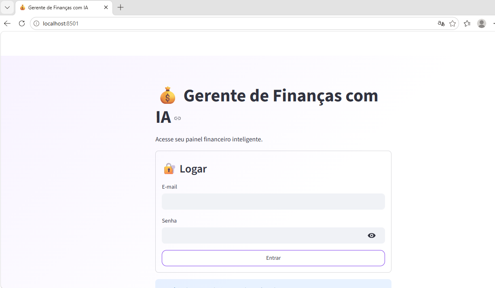
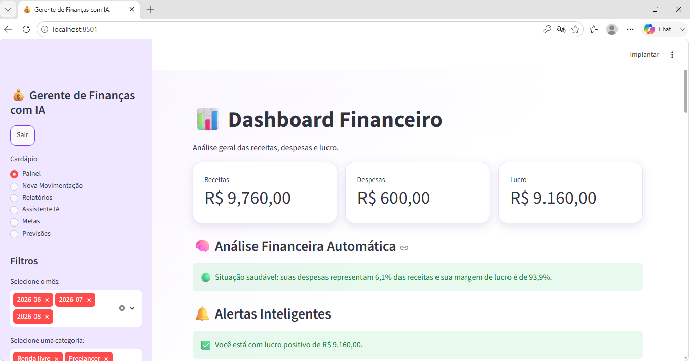
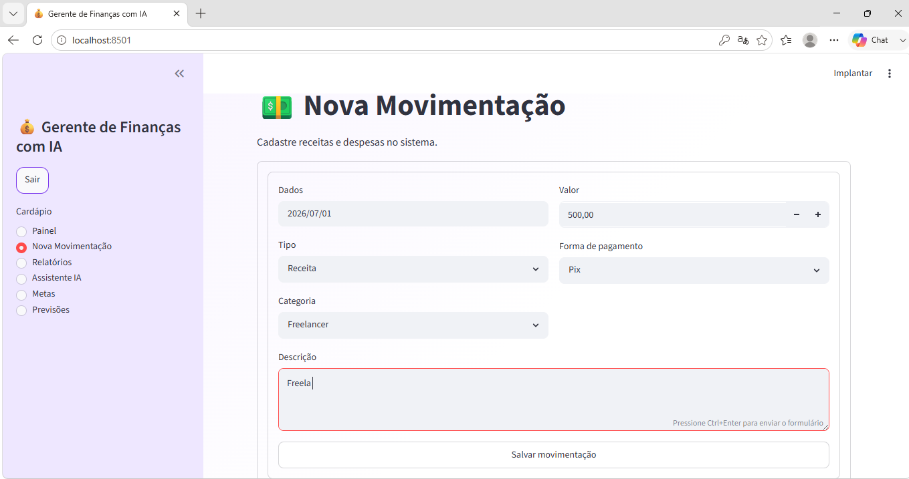
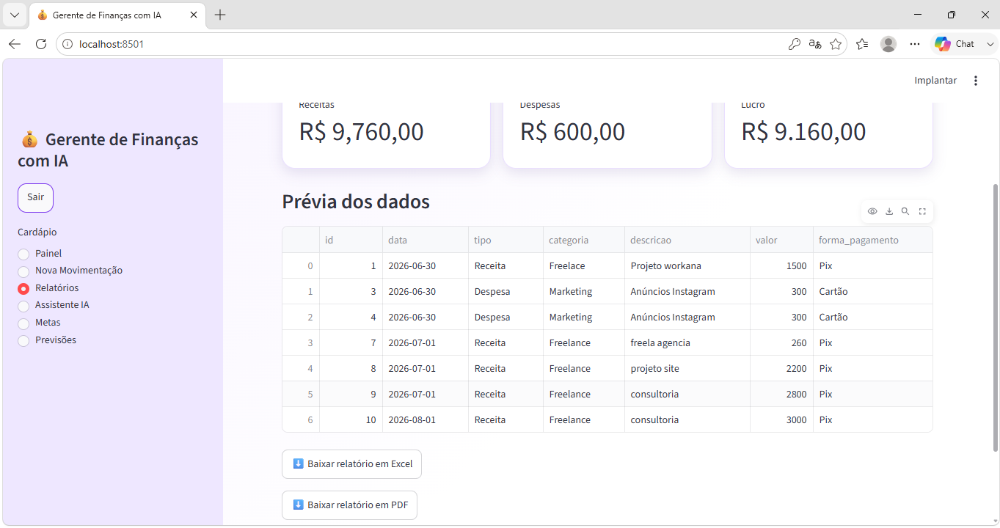
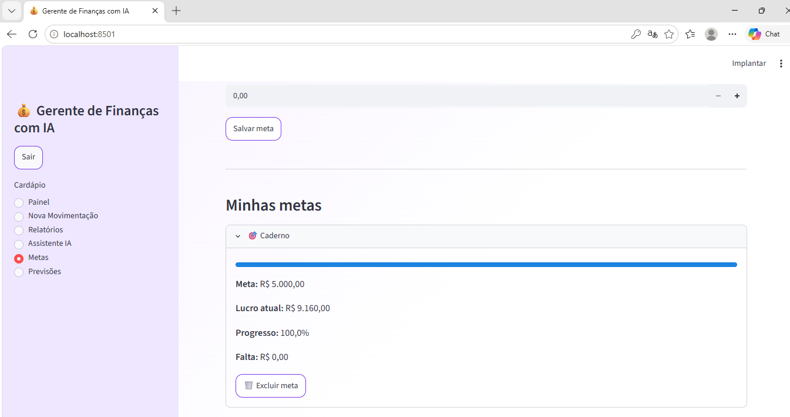
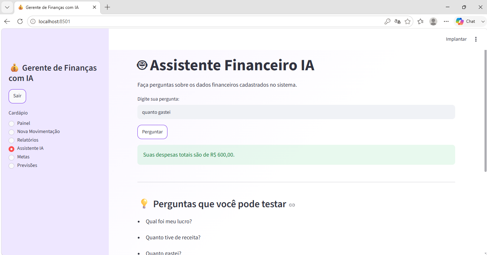
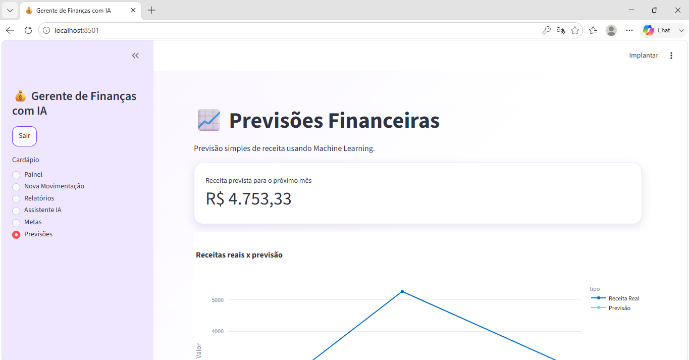

# 💰 Gerente de Finanças com IA

Sistema web desenvolvido em **Python + Streamlit + PostgreSQL + Machine Learning** para gerenciamento financeiro pessoal, com dashboard interativo, relatórios, metas financeiras, previsões de receitas utilizando IA e assistente financeiro.

---

# 🚀 Demonstração

## 🔑 Login de teste

**Usuário:** `admin`

**Senha:** `1234`

---

# ✨ Funcionalidades

- ✅ Login de usuário
- ✅ Cadastro de Receitas e Despesas
- ✅ Edição de movimentações
- ✅ Exclusão de movimentações
- ✅ Dashboard Financeiro
- ✅ Indicadores Financeiros
- ✅ Gráficos Interativos
- ✅ Fluxo de Caixa
- ✅ Filtros por mês e categoria
- ✅ Exportação para Excel
- ✅ Exportação para PDF
- ✅ Assistente Financeiro com IA
- ✅ Metas Financeiras
- ✅ Previsão Financeira utilizando Machine Learning
- ✅ Banco de Dados PostgreSQL

---

# 🛠 Tecnologias Utilizadas

- Python
- Streamlit
- PostgreSQL
- Pandas
- Plotly
- SQLAlchemy
- Scikit-Learn
- OpenPyXL
- ReportLab

---

# 📸 Telas do Sistema

## 🔐 Login



---

## 📊 Dashboard Financeiro



---

## 💵 Cadastro de Movimentações



---

## 📄 Relatórios



---

## 🎯 Metas Financeiras



---

## 🤖 Assistente Financeiro IA



---

## 📈 Previsões Financeiras



---

# 📂 Estrutura do Projeto

```text
AI-Finance-Manager
│
├── dashboard
├── data
├── src
├── requirements.txt
└── README.md
```

---

# ⚙️ Como executar o projeto

### Clone o repositório

```bash
git clone https://github.com/giovannag-tech/AI-Finance-Manager.git
```

### Entre na pasta do projeto

```bash
cd AI-Finance-Manager
```

### Instale as dependências

```bash
pip install -r requirements.txt
```

### Execute o sistema

```bash
streamlit run dashboard/app.py
```

---

# 👩‍💻 Desenvolvido por

**Giovanna Gomes Oliveira**

### GitHub

https://github.com/giovannag-tech

### LinkedIn

https://www.linkedin.com/in/giovannatecnologiadados23

---

⭐ Se este projeto foi útil ou interessante, deixe uma estrela no repositório!