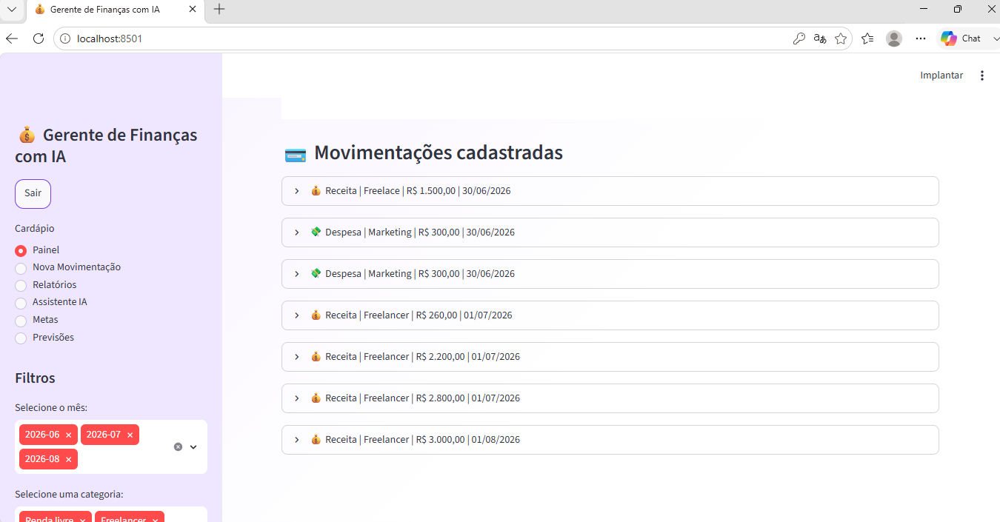

# 💰 Gerente de Finanças com IA

Sistema web desenvolvido em **Python + Streamlit + PostgreSQL** para gerenciamento financeiro pessoal, com recursos de Inteligência Artificial, Machine Learning, metas financeiras, geração de relatórios e dashboard interativo.

---

# 🚀 Funcionalidades

- ✅ Login de usuário
- ✅ Cadastro de Receitas e Despesas
- ✅ Edição de movimentações
- ✅ Exclusão de movimentações
- ✅ Dashboard Financeiro
- ✅ Filtros por mês e categoria
- ✅ Indicadores financeiros
- ✅ Análise automática da saúde financeira
- ✅ Fluxo de caixa acumulado
- ✅ Metas Financeiras
- ✅ Assistente Financeiro com IA
- ✅ Previsão de receitas utilizando Machine Learning
- ✅ Exportação para Excel
- ✅ Exportação para PDF
- ✅ Banco de Dados PostgreSQL

---

# 🧠 Tecnologias Utilizadas

- Python
- Streamlit
- PostgreSQL
- Pandas
- Plotly
- Scikit-Learn
- OpenPyXL
- Psycopg2
- ReportLab

---

# 🔐 Login de Teste

Para facilitar a demonstração do sistema:

**Usuário**

```
admin
```

**Senha**

```
123456
```

---

# 📂 Estrutura do Projeto

```
AI-Finance-Manager
│
├── dashboard/
│   ├── app.py
│   ├── dashboard.py
│   ├── cadastro.py
│   ├── relatorios.py
│   ├── metas.py
│   ├── previsoes.py
│   ├── assistente_ia.py
│   ├── style.py
│   └── images/
│
├── src/
│   ├── conexao.py
│   ├── tratamento_dados.py
│   ├── metas_db.py
│   └── teste_conexao.py
│
├── data/
│   └── dados_financeiros.csv
│
├── requirements.txt
└── README.md
```

---

# ⚙️ Como executar

Clone o repositório

```bash
git clone https://github.com/giovannag-tech/AI-Finance-Manager.git
```

Entre na pasta

```bash
cd AI-Finance-Manager
```

Instale as dependências

```bash
pip install -r requirements.txt
```

Execute a aplicação

```bash
streamlit run dashboard/app.py
```

---

# 📸 Telas do Sistema

## 🔐 Login


---

## 📊 Dashboard Financeiro


---

## 💵 Cadastro de Movimentações



---

## 📄 Relatórios


---

## 🎯 Metas Financeiras


---

## 🤖 Assistente Financeiro IA


---

## 📈 Previsões Financeiras


---

# 📊 Inteligência Artificial

O sistema possui um assistente financeiro integrado que interpreta perguntas do usuário e fornece recomendações sobre receitas, despesas, investimentos e organização financeira.

Também conta com um modelo de Machine Learning utilizando **Linear Regression**, capaz de prever receitas futuras com base no histórico financeiro cadastrado.

---

# 📈 Relatórios

O sistema permite exportar:

- 📄 Relatórios em PDF
- 📊 Relatórios em Excel

facilitando o compartilhamento e análise dos dados financeiros.

---

# 🎯 Objetivo

Este projeto foi desenvolvido para demonstrar conhecimentos em:

- Desenvolvimento Web com Python
- Streamlit
- PostgreSQL
- Manipulação de Dados
- Machine Learning
- Inteligência Artificial
- Visualização de Dados
- Organização de Projetos
- Boas práticas de desenvolvimento

---

# 👩‍💻 Desenvolvido por

**Giovanna Gomes Oliveira**

GitHub:
https://github.com/giovannag-tech

LinkedIn:
https://www.linkedin.com/in/giovannatecnologiadados23